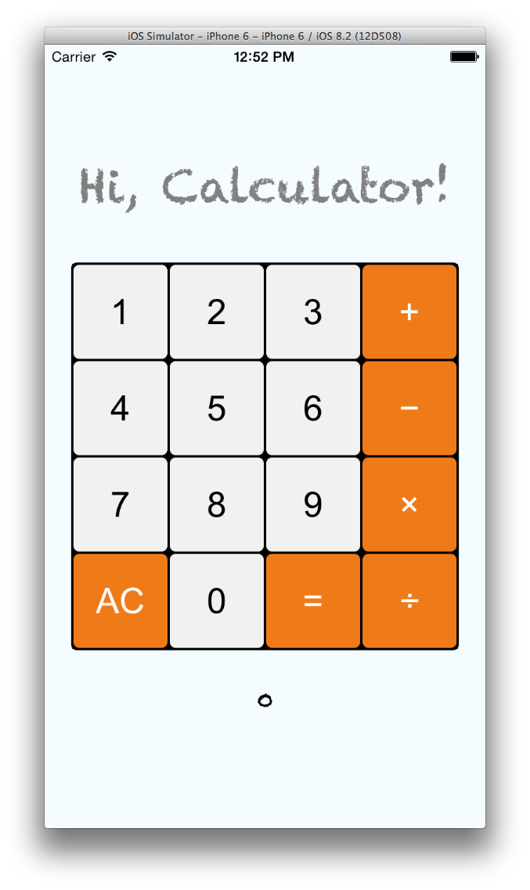

#Calculator using React Native

##Getting Started
###Requirements 
- OS X - This repo only contains the iOS implementation right now, and Xcode only runs on Mac.
- New to Xcode? Download it from the Mac App Store.
- Homebrew is the recommended way to install node, watchman, and flow.
- **brew install node**. New to node or npm?
- **brew install watchman**. We recommend installing watchman, otherwise you might hit a node file watching bug.
- **brew install flow**. If you want to use flow.
###Quick start 
- **npm install -g react-native-cli**
- **react-native init AwesomeProject**

In the newly created folder AwesomeProject/

- Open AwesomeProject.**xcodeproj** and hit run in Xcode
- Open **index.ios.js** in your text editor of choice and edit some lines
- Hit cmd+R (twice) in your iOS simulator to reload the app and see your change!

**Congratulations**! You've just successfully run and modified your first React Native app.

##好，廢話完畢。
###上圖。

###使用方式
1. 用 XCode開
2. ⌘ + R 跑！
3. 玩。

不要關掉terminal，他是依據npm去跑的。

耶有node，最近一直看到他，不舒服。

###心得
乾，用react native交作業好像有點太高級了..........
然後react native 的 github裡面有一包 example，可以好好參考，他都把他做出來的UI都做好了。